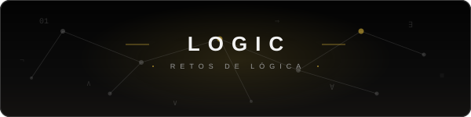

  <picture>
    <source media="(prefers-color-scheme: dark)" srcset="./img/header-dark.svg">
    <source media="(prefers-color-scheme: light)" srcset="./img/header-light.svg">
    
  </picture>

 

Retos de lógica de programación.

El objetivo no es aprender sintaxis ni un lenguaje concreto, sino desarrollar las habilidades de razonamiento necesarias para resolver problemas: descomponer problemas, diseñar soluciones, detectar errores, analizar casos límite y evaluar soluciones generadas por IA.

Los retos son independientes del lenguaje de programación y utilizan diferentes formatos: problemas de lógica, debugging, lectura de código, algoritmos, entrevistas técnicas, simulaciones y toma de decisiones.

## Retos

### Dificultad 1/5

- [Reto 001 — El cambio](./retos/dificultad1-5/001-el_cambio/enunciado.md)
- [Reto 002 — La regla que parece funcionar](./retos/dificultad1-5/002-la_regla_que_parece_funcionar/enunciado.md)
- [Reto 003 — La condición que falta](./retos/dificultad1-5/003-la_condicion_que_falta/enunciado.md)
